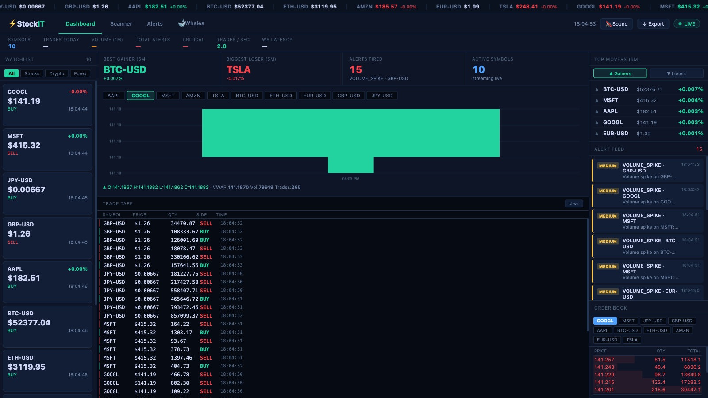
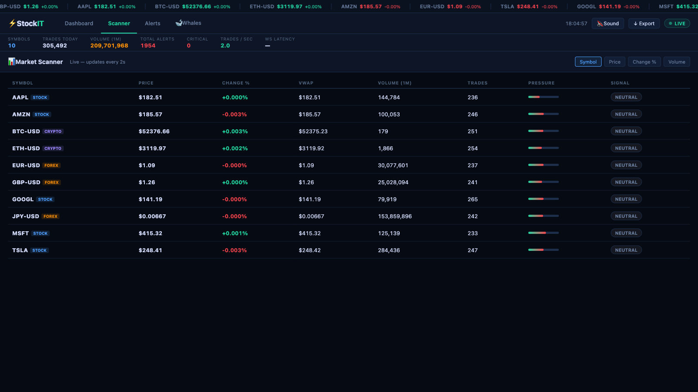
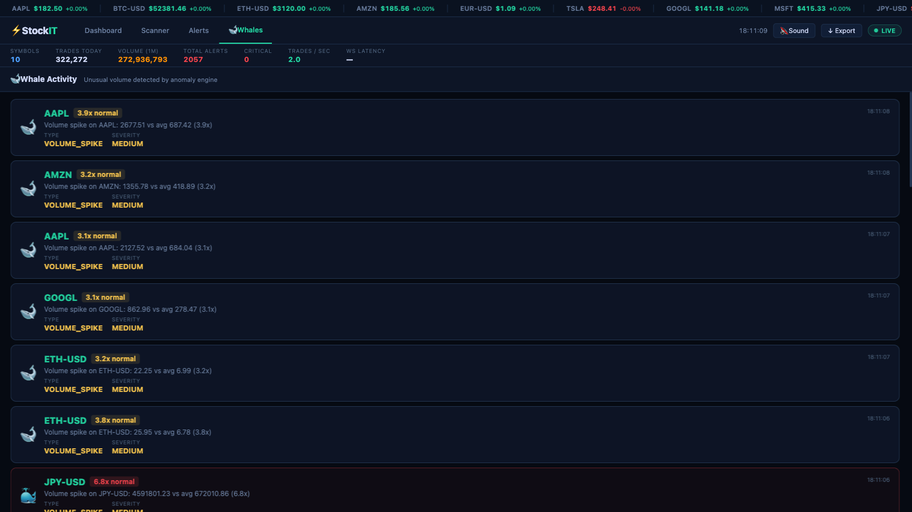
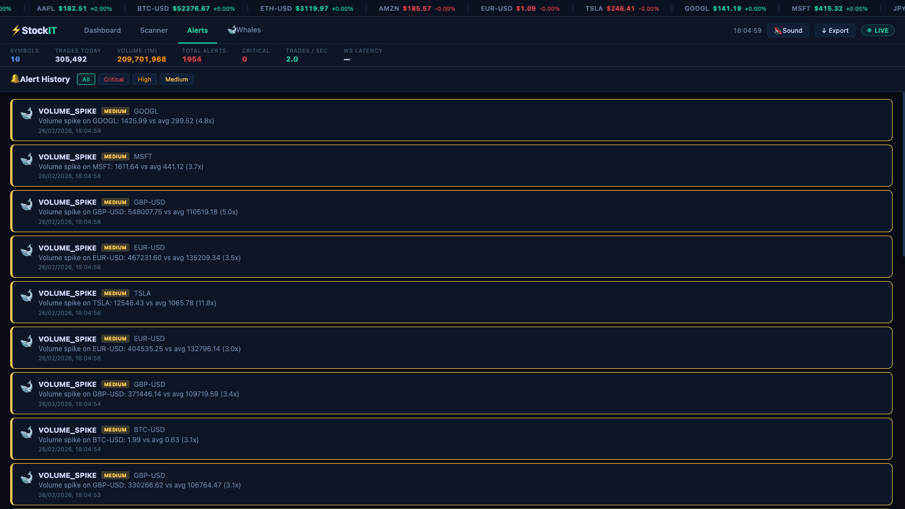

# Stock-IT — Real-Time Financial Trade Monitoring System


An end-to-end **streaming data pipeline** that ingests, processes, detects anomalies, and visualizes financial trade data in real time — built with a Lambda architecture using Apache Kafka, Redis, and TimescaleDB.

---

## Live Demo

> Dashboard: [https://tinyurl.com/trade-monitor-stock-it](https://tinyurl.com/trade-monitor-stock-it)
>
> *(Requires local Docker setup — see Quick Start below)*

---

## Dashboard Preview

### Main Dashboard


> Live price watchlist, 1-min candlestick charts, order book depth, trade tape, and alert feed — all streaming via WebSocket.

### Market Scanner


> Sortable scanner table with real-time VWAP, volume, buy/sell pressure, and BUY/SELL/NEUTRAL signal classification per symbol.

### Whale Activity


> Volume spike alerts surfaced as whale cards — detected by the anomaly engine when volume exceeds 3x rolling average.

### Alert History


> Full alert log with severity filtering (Critical / High / Medium) — powered by the circuit breaker + deduplication engine.

---

## Architecture

```
┌──────────────────────────────────────────────────────────────────┐
│                    STOCK-IT PIPELINE                              │
│                                                                   │
│  ┌──────────────┐   raw-trades    ┌──────────────────┐           │
│  │   Producer   │ ──────────────► │ Stream Processor │           │
│  │              │                 │                  │           │
│  │ GBM price    │                 │ • VWAP (incr.)   │           │
│  │ simulation   │                 │ • OHLCV windows  │           │
│  │ 10 symbols   │                 │   (1m/5m/15m)    │           │
│  │ ~50 msg/sec  │                 │ • Anomaly detect │           │
│  └──────────────┘                 └────────┬─────────┘           │
│                                            │                     │
│                              trade-alerts  │  trade-aggregates   │
│                                  ┌─────────┴──────────┐          │
│                                  │                    │          │
│                                  ▼                    ▼          │
│                       ┌──────────────────┐   ┌──────────────┐   │
│                       │  Alert Engine    │   │  FastAPI     │   │
│                       │                  │   │              │   │
│                       │ • Dedup (Redis)  │   │ REST / WS    │   │
│                       │ • Circuit breaker│   │ SSE          │   │
│                       │ • Webhook routing│   │              │   │
│                       └──────────────────┘   └──────┬───────┘   │
│                                                      │           │
│                                              ┌───────▼──────┐   │
│                                              │  Dashboard   │   │
│                                              │  (HTML/JS)   │   │
│                                              └──────────────┘   │
│                                                                   │
│   ┌────────────────────────────────────────────────────────┐     │
│   │                     Data Layer                          │     │
│   │   Redis (speed layer)        TimescaleDB (batch layer) │     │
│   └────────────────────────────────────────────────────────┘     │
│                                                                   │
│   ┌────────────────────────────────────────────────────────┐     │
│   │                  Monitoring Stack                        │     │
│   │      Prometheus (metrics scraping)   Grafana (viz)     │     │
│   └────────────────────────────────────────────────────────┘     │
└──────────────────────────────────────────────────────────────────┘
```

---

## Tech Stack

| Layer | Technology | Purpose |
|---|---|---|
| **Ingestion** | Apache Kafka | 3 topics, partitioned by symbol, durable log |
| **Processing** | Python (confluent-kafka) | VWAP, OHLCV windows, anomaly detection |
| **Speed Layer** | Redis | Latest prices, rolling buffers, alert dedup |
| **Batch Layer** | TimescaleDB | Hypertables, continuous aggregates, 30-day retention |
| **API** | FastAPI | REST + WebSocket + SSE endpoints |
| **Dashboard** | Vanilla HTML/JS | Canvas candlesticks, WebSocket streaming |
| **Monitoring** | Prometheus + Grafana | Pipeline metrics, alerting |
| **Orchestration** | Docker Compose | 11 services, health checks, restart policies |

---

## Services & Ports

| Service | Port | Description |
|---|---|---|
| **Dashboard / API** | `8088` | FastAPI + live trading dashboard |
| **Kafka UI** | `8090` | Inspect topics, messages, consumer groups |
| **Grafana** | `3001` | Pre-built pipeline monitoring dashboard |
| **Prometheus** | `9090` | Metrics scraping |
| **TimescaleDB** | `5433` | Time-series PostgreSQL |
| **Redis** | `6379` | State store |
| **Producer metrics** | `8001` | Prometheus scrape endpoint |
| **Processor metrics** | `8002` | Prometheus scrape endpoint |
| **Alert Engine metrics** | `8003` | Prometheus scrape endpoint |

---

## Kafka Topics

| Topic | Producer | Consumer | Purpose |
|---|---|---|---|
| `raw-trades` | Trade Producer | Stream Processor | Raw trade events, partitioned by symbol |
| `trade-alerts` | Stream Processor | Alert Engine + API | Anomaly alert events |
| `trade-aggregates` | Stream Processor | API | Completed OHLCV window events |

---

## Anomaly Detection

| Alert Type | Severity | Trigger Condition |
|---|---|---|
| `PRICE_SPIKE` | HIGH | Price moves >5% from rolling average in one tick |
| `CIRCUIT_BREAKER` | CRITICAL | Price moves >10% — mimics real exchange halt logic |
| `VOLUME_SPIKE` | MEDIUM | Trade volume >3x rolling average — whale detection |

### Circuit Breaker State Machine
```
CLOSED ──[>10% move]──► OPEN ──[5 min timeout]──► HALF_OPEN ──[normal]──► CLOSED
```

---

## Quick Start

### Prerequisites
- Docker Desktop
- 4 GB RAM minimum

### Run

```bash
# Clone the repo
git clone https://github.com/YOUR_USERNAME/stock-it.git
cd stock-it

# Start all 11 services
docker compose up -d --build

# Check all services are healthy
docker compose ps

# Open dashboard
open http://localhost:8088

# Open API docs
open http://localhost:8088/docs

# Inspect Kafka topics
open http://localhost:8090

# Open Grafana  (admin / admin123)
open http://localhost:3001
```

### Teardown

```bash
docker compose down -v
```

---

## API Reference

### REST Endpoints

```bash
# Live prices for all symbols
GET /api/v1/prices

# Current OHLCV window (1m default)
GET /api/v1/ohlcv/AAPL?window_seconds=60

# Recent trades from Redis
GET /api/v1/trades/AAPL?limit=50

# Historical trades from TimescaleDB
GET /api/v1/trades/history?symbol=AAPL&limit=100

# Active alerts
GET /api/v1/alerts?unacked_only=true&severity=HIGH

# Top movers by 5m % change
GET /api/v1/stats/movers

# Simulated order book depth
GET /api/v1/orderbook/AAPL?depth=10

# Buy/sell pressure ratio
GET /api/v1/trades/AAPL/pressure

# Market-wide summary KPIs
GET /api/v1/stats/summary
```

### WebSocket Endpoints

```javascript
// Live price tick (1s intervals, all symbols)
const ws = new WebSocket('ws://localhost:8088/ws/prices');

// Live alert stream
const ws = new WebSocket('ws://localhost:8088/ws/alerts');

// OHLCV window completions
const ws = new WebSocket('ws://localhost:8088/ws/aggregates');
```

### SSE

```bash
curl -N http://localhost:8088/api/v1/stream/prices
```

---

## Data Flow

```
1. Producer generates trade: {symbol, price, quantity, side, exchange, timestamp}
   └─ Uses Geometric Brownian Motion: dS = S(μdt + σdW)
   └─ 10 symbols: AAPL, GOOGL, MSFT, AMZN, TSLA, BTC-USD, ETH-USD, EUR-USD, GBP-USD, JPY-USD

2. Published to Kafka: raw-trades (partitioned by symbol → in-order per symbol)

3. Stream Processor consumes raw-trades:
   ├─ Updates Redis: latest price hash, rolling 100-trade deque, sorted-set time-series
   ├─ Updates OHLCV windows (tumbling 1m/5m/15m) → publishes to trade-aggregates on rollover
   ├─ Runs anomaly detection → publishes alerts to trade-alerts
   └─ Batch inserts to TimescaleDB every 5s (execute_batch)

4. Alert Engine consumes trade-alerts:
   ├─ Deduplicates via Redis TTL keys (per alert_type + symbol)
   ├─ Manages circuit breaker FSM per symbol
   └─ Routes to webhook / log based on severity

5. FastAPI bridges Kafka → WebSocket → Dashboard
   ├─ Redis reads for real-time data (<1ms)
   └─ TimescaleDB reads for historical queries

6. Prometheus scrapes all 5 services every 5s → Grafana visualizes
```

---

## Key Engineering Decisions

### Lambda Architecture
- **Speed layer (Redis)**: Sub-millisecond reads for latest prices, rolling buffers, current OHLCV window
- **Batch layer (TimescaleDB)**: Full trade history with hypertables, continuous aggregates, and 30-day retention policy

### Partitioning Strategy
`raw-trades` is partitioned by **symbol** — guarantees message ordering per symbol, which is required for correct sequential VWAP computation and anomaly detection state.

### Incremental VWAP
```
VWAP = Σ(Price × Volume) / Σ(Volume)
```
Maintained with a `pv_sum` accumulator per window in memory. No recomputation of historical data on each tick — O(1) update complexity.

### Alert Deduplication
Redis TTL keys per `(alert_type, symbol)` suppress duplicate alerts:
- `CIRCUIT_BREAKER` → 5-minute cooldown
- `PRICE_SPIKE` → 1-minute cooldown
- `VOLUME_SPIKE` → 30-second cooldown

### Exactly-Once Semantics
- `enable.auto.commit=False` — offsets committed only after successful processing
- All DB inserts use `ON CONFLICT DO NOTHING` keyed on `trade_id`

### Backpressure Handling
Kafka producer: `linger.ms=5`, `batch.size=65536`. PostgreSQL writer: 5-second batch flush via `execute_batch` — decouples ingestion throughput from storage throughput.

---

## Project Structure

```
stock-it/
├── docker-compose.yml          # Orchestrates all 11 services
├── .env                        # Environment variables
├── start.sh                    # One-command startup script
├── producer/
│   ├── trade_producer.py       # GBM trade simulator → Kafka
│   ├── Dockerfile
│   └── requirements.txt
├── processor/
│   ├── stream_processor.py     # VWAP, OHLCV windows, anomaly detection
│   ├── Dockerfile
│   └── requirements.txt
├── api/
│   ├── app.py                  # FastAPI + WebSocket + SSE
│   ├── Dockerfile
│   └── requirements.txt
├── alerts/
│   ├── alert_engine.py         # Dedup, circuit breaker FSM, routing
│   ├── Dockerfile
│   └── requirements.txt
├── dashboard/
│   └── index.html              # Real-time trading dashboard
├── monitoring/
│   ├── prometheus.yml          # Scrape config for all services
│   └── grafana/
│       ├── provisioning/       # Auto-provision datasources
│       └── dashboards/         # Pre-built 13-panel dashboard JSON
├── scripts/
│   └── init_db.sql             # TimescaleDB schema, hypertables, retention policy
└── tests/
    ├── test_processor.py       # Unit tests: WindowManager, AnomalyDetector
    └── test_alert_engine.py    # Unit tests: CircuitBreaker, DeduplicationFilter
```

---

## Tests

```bash
python -m pytest tests/ -v
```

24 unit tests covering VWAP computation, OHLCV window rollover, anomaly detection thresholds, circuit breaker state transitions, and alert deduplication.

---

## Monitoring Metrics

| Metric | Type | Description |
|---|---|---|
| `producer_trades_total` | Counter | Trades published, labeled by symbol/side |
| `producer_latency_seconds` | Histogram | Kafka produce latency p50/p95/p99 |
| `processor_trades_total` | Counter | Trades processed by symbol |
| `processor_alerts_total` | Counter | Alerts fired by type and severity |
| `processor_price` | Gauge | Current price per symbol |
| `alertengine_circuit_breakers_open` | Gauge | Currently open circuit breakers |
| `alertengine_deduped_total` | Counter | Suppressed duplicate alerts |

---

## Interview Q&A

**Q: Why Kafka instead of direct REST/queue?**
> Kafka's durable, partitioned log decouples producers from consumers, allows replay, and enables multiple consumers (processor + API) to independently read the same stream at their own pace.

**Q: How does your pipeline handle backpressure?**
> The stream processor decouples Kafka consumption from PostgreSQL writes using a 5-second batch buffer. Kafka's durable log absorbs upstream bursts while the DB writer flushes at a controlled rate.

**Q: How do you ensure exactly-once processing?**
> Manual offset commits (`enable.auto.commit=False`) — offsets advance only after successful processing. Idempotent DB inserts via `ON CONFLICT DO NOTHING` on `trade_id`.

**Q: How does VWAP work in a streaming context?**
> Incremental `pv_sum` accumulator per tumbling window: `VWAP = Σ(price×volume) / Σ(volume)`. Windows reset on time boundary crossing — no historical recomputation needed.

**Q: What's the difference between your speed and batch layers?**
> Redis (speed layer) serves sub-millisecond reads for real-time dashboard data. TimescaleDB (batch layer) handles historical range queries, continuous aggregates, and long-term retention — classic Lambda architecture split.
